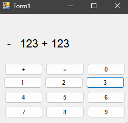

<div align="center">
JURNAL <br>
KONSTRUKSI PERANGKAT LUNAK <br>
<!-- JUDUL -->
<br>


<br>

Disusun Oleh: <br>
Afad Fath Musyarof Halim <br>
2211104030 <br>
SE-06-01 <br>

<br>

Asisten Praktikum : <br>
Naufal El Kamil Aditya Pratama Rahman <br>
Imelda Alfiana Palupi Dewi <br>

<br>

Dosen Pengampu : <br>
Yudha Islami Sulistya, S.Kom., M.Cs <br>

<br>

PROGRAM STUDI S1 REKAYASA PERANGKAT LUNAK <br>
FAKULTAS INFORMATIKA <br> 
TELKOM UNIVERSITY PURWOKERTO <br>

</div>
<hr>

## 1. Membuat Project <br>

## 2. Implementasi Kode <br>
``` C#
namespace jurnal
{
    public partial class Form1 : Form
    {
        private int currentValue = 0;
        private int storedValue = 0;
        private bool isAdding = false;

        public Form1()
        {
            InitializeComponent();
        }

        private void label1_Click(object sender, EventArgs e)
        {

        }

        public void angka(object sender, EventArgs e)
        {
            Button btn = sender as Button;
            if (btn != null)
            {
                label1.Text += btn.Text;
            }
        }

        private void button1_Click(object sender, EventArgs e)
        {
            Button btn = sender as Button;
            if (btn != null)
            {
                label1.Text += " " + btn.Text + " ";
            }
        }

        private void btnEquals_Click_1(object sender, EventArgs e)
        {
            try {
                var result = new DataTable().Compute(label1.Text, null);
                label1.Text = result.ToString();
            }
            catch (Exception ex) {
                label1.Text = ex.Message;
            }
        }

        private void button3_Click(object sender, EventArgs e) { angka(sender, e);}
        private void button6_Click(object sender, EventArgs e) { angka(sender, e);}
        private void button5_Click(object sender, EventArgs e) { angka(sender, e);}
        private void button4_Click(object sender, EventArgs e) { angka(sender, e);}
        private void button9_Click(object sender, EventArgs e) { angka(sender, e);}
        private void button8_Click(object sender, EventArgs e) { angka(sender, e);}
        private void button7_Click(object sender, EventArgs e) { angka(sender, e);}
        private void button12_Click(object sender, EventArgs e){ angka(sender, e);}
        private void button11_Click(object sender, EventArgs e){ angka(sender, e);}
        private void button10_Click(object sender, EventArgs e){ angka(sender, e);}
    }
}

```
## 3. Output <br>
1. Before Add <br>
   
2. After Add <br>
   
## 4. Penjelasan <br>
Kode ini membuat kalkulator sederhana dengan GUI menggunakan C#, di mana tombol angka menambahkan digit ke tampilan, tombol operator menyisipkan operator dengan spasi, dan tombol sama dengan (`=`) mengevaluasi ekspresi matematika menggunakan `DataTable.Compute` untuk menampilkan hasilnya. Error handling ditambahkan untuk menangani kasus ekspresi yang tidak valid.