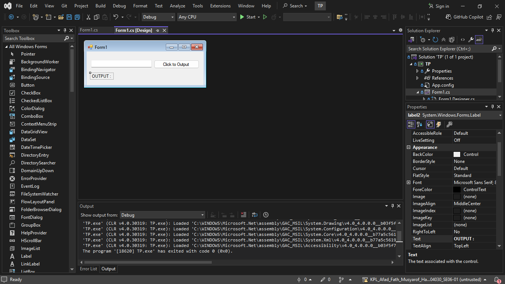
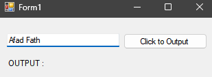
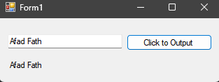

<div align="center">
TUGAS PENDAHULUAN <br>
KONSTRUKSI PERANGKAT LUNAK <br>
<!-- JUDUL -->
<br>


<br>

Disusun Oleh: <br>
Afad Fath Musyarof Halim <br>
2211104030 <br>
SE-06-01 <br>

<br>

Asisten Praktikum : <br>
Naufal El Kamil Aditya Pratama Rahman <br>
Imelda Alfiana Palupi Dewi <br>

<br>

Dosen Pengampu : <br>
Yudha Islami Sulistya, S.Kom., M.Cs <br>

<br>

PROGRAM STUDI S1 REKAYASA PERANGKAT LUNAK <br>
FAKULTAS INFORMATIKA <br> 
TELKOM UNIVERSITY PURWOKERTO <br>

</div>
<hr>

## 1. Membuat Project <br>

## 2. Implementasi Kode <br>
``` C#
namespace TP
{
    public partial class Form1 : Form
    {
        public Form1() {
            InitializeComponent();
        }

        private void button1_Click(object sender, EventArgs e) {
            label2.Text = textBox1.Text.ToString();
        }
    }
}
```
## 3. Output <br>
1. Before <br>
   
2. After <br>
   
   
## 4. Penjelasan <br>
Kode ini mengambil teks yang dimasukkan ke dalam `TextBox` ketika `Button` diklik dan menampilkannya di `Label` dengan mengubah properti `Text` dari `Label`. Hal ini memungkinkan pengguna untuk melihat isi `TextBox` secara langsung di `Label` saat tombol ditekan.