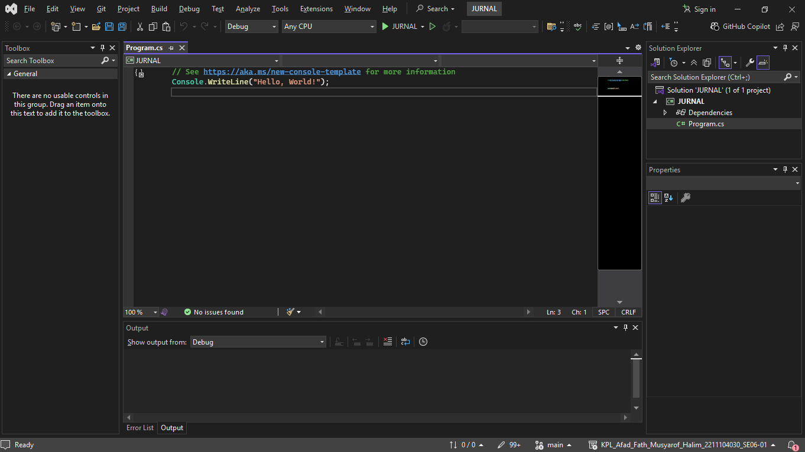

JURNAL  
KONSTRUKSI PERANGKAT LUNAK  
<!-- JUDUL -->
 

 

Disusun Oleh:  
Afad Fath Musyarof Halim  
2211104030  
SE-06-01  

 

Asisten Praktikum :  
Naufal El Kamil Aditya Pratama Rahman  
Imelda Alfiana Palupi Dewi  

 

Dosen Pengampu :  
Yudha Islami Sulistya, S.Kom., M.Cs  

 

PROGRAM STUDI S1 REKAYASA PERANGKAT LUNAK  
FAKULTAS INFORMATIKA   
TELKOM UNIVERSITY PURWOKERTO  

## 1. Membuat Project Console

## 2. Implementasi Kode

## 3. Output

## 4. Penjelasan
