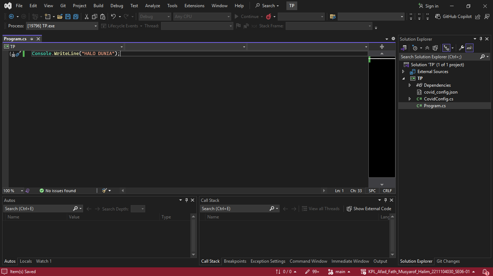
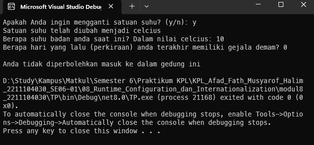

<div align="center">
TUGAS PENDAHULUAN <br>
KONSTRUKSI PERANGKAT LUNAK <br>
<!-- JUDUL -->
<br>


<br>

Disusun Oleh: <br>
Afad Fath Musyarof Halim <br>
2211104030 <br>
SE-06-01 <br>

<br>

Asisten Praktikum : <br>
Naufal El Kamil Aditya Pratama Rahman <br>
Imelda Alfiana Palupi Dewi <br>

<br>

Dosen Pengampu : <br>
Yudha Islami Sulistya, S.Kom., M.Cs <br>

<br>

PROGRAM STUDI S1 REKAYASA PERANGKAT LUNAK <br>
FAKULTAS INFORMATIKA <br> 
TELKOM UNIVERSITY PURWOKERTO <br>

</div>
<hr>

## 1. Buat Project Console <br>

## 2. Implementasi Kode
1. Program.cs
   ``` C#
    using TP;

    class Program
    {
        static void Main()
        {
            CovidConfig config = CovidConfig.Load();

            Console.Write("Apakah Anda ingin mengganti satuan suhu? (y/n): ");
            if (Console.ReadLine().ToLower() == "y")
            {
                config.GantiJenis();
                Console.WriteLine("Satuan suhu telah diubah menjadi " + config.Jenis);
            }

            Console.Write($"Berapa suhu badan anda saat ini? Dalam nilai {config.Jenis}: ");
            double suhu = Convert.ToDouble(Console.ReadLine());

            Console.Write("Berapa hari yang lalu (perkiraan) anda terakhir memiliki gejala demam?");
            int Hari = Convert.ToInt32(Console.ReadLine());

            bool suhuValidasi = (config.Jenis == "celcius" && suhu <= 37.5) ||
                            (config.Jenis == "fahrenheit" && suhu <= 99.5);

            bool hariValidasi = Hari >= config.Hari;

            Console.WriteLine();
            Console.WriteLine(suhuValidasi && hariValidasi ? config.Tolak : config.Terima);
        }
    }
   ```
2. CovidConfig.cs
   ``` C#
    using System;
    using System.IO;
    using System.Xml;
    using Newtonsoft.Json;

    namespace TP
    {
        class CovidConfig
        {
            private const string ConfigFile = "covid_config.json";

            public string Jenis { get; set; } = "celcius";
            public int Hari { get; set; } = 14;
            public string Terima { get; set; } = "Anda tidak diperbolehkan masuk ke dalam gedung ini";
            public string Tolak { get; set; } = "Anda dipersilahkan untuk masuk ke dalam gedung ini";

            public static CovidConfig Load()
            {
                if (File.Exists(ConfigFile))
                {
                    string json = File.ReadAllText(ConfigFile);
                    return JsonConvert.DeserializeObject<CovidConfig>(json);
                }
                else
                {
                    var defaultConfig = new CovidConfig();
                    defaultConfig.Save();
                    return defaultConfig;
                }
            }

            public void Save()
            {
                string json = JsonConvert.SerializeObject(this, Newtonsoft.Json.Formatting.Indented);
                File.WriteAllText(ConfigFile, json);
            }

            public void GantiJenis()
            {
                Jenis = Jenis == "celcius" ? "fahrenheit" : "celcius";
                Save();
            }
        }
    }
   ``` 
3. covid_config.json
   ``` JSON
   {
        "satuan_suhu": "CONFIG1",
        "batas_hari_deman": "CONFIG2",
        "pesan_ditolak": "CONFIG3",
        "pesan_diterima": "CONFIG4"
    }
   ```
## 3. Output
   
## 4. Penjelasan
1. **Program.cs**: Program ini adalah aplikasi konsol yang memeriksa suhu tubuh dan lamanya gejala demam pengguna. Bergantung pada konfigurasi yang dimuat dari `CovidConfig`, program akan menentukan apakah pengguna diperbolehkan masuk ke gedung atau tidak.

2. **CovidConfig.cs**: Kelas ini bertanggung jawab untuk mengelola konfigurasi aplikasi, seperti satuan suhu, batas hari demam, dan pesan terima/tolak. Konfigurasi disimpan dalam file JSON dan dapat diubah oleh pengguna melalui aplikasi.

3. **covid_config.json**: File JSON ini menyimpan konfigurasi default aplikasi, seperti satuan suhu, batas hari demam, dan pesan untuk diterima atau ditolak. File ini digunakan oleh `CovidConfig` untuk memuat dan menyimpan konfigurasi.