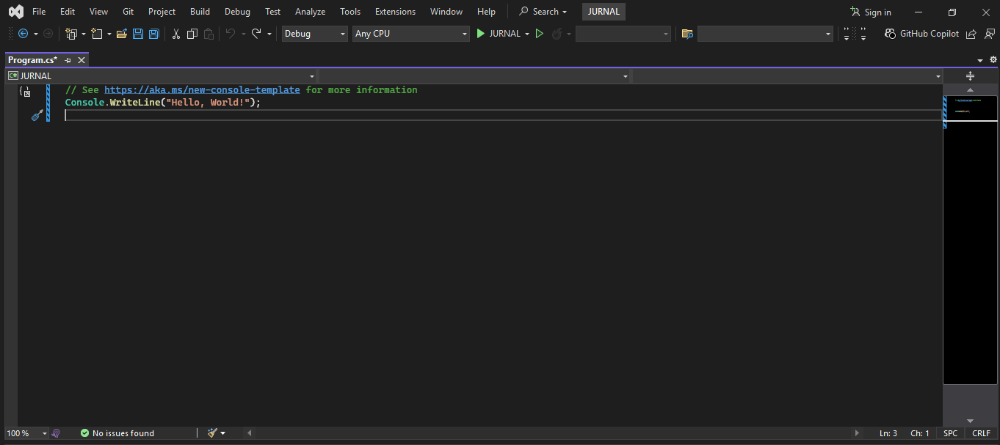
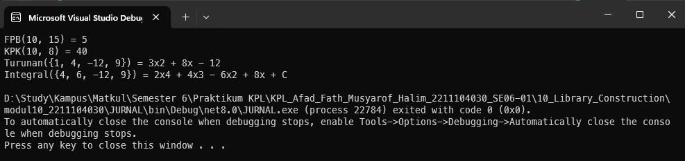

<div align="center">
JURNAL <br>
KONSTRUKSI PERANGKAT LUNAK <br>
<!-- JUDUL -->
<br>


<br>

Disusun Oleh: <br>
Afad Fath Musyarof Halim <br>
2211104030 <br>
SE-06-01 <br>

<br>

Asisten Praktikum : <br>
Naufal El Kamil Aditya Pratama Rahman <br>
Imelda Alfiana Palupi Dewi <br>

<br>

Dosen Pengampu : <br>
Yudha Islami Sulistya, S.Kom., M.Cs <br>

<br>

PROGRAM STUDI S1 REKAYASA PERANGKAT LUNAK <br>
FAKULTAS INFORMATIKA <br> 
TELKOM UNIVERSITY PURWOKERTO <br>

</div>
<hr>

## 1. Membuat Project <br>

## 2. Membuat Library <br>
``` C#
using System.Text;

namespace MatematikaLibraries
{
    public class Class1
    {
        public int FPB(int input1, int input2)
        {
            while (input2 != 0)
            {
                int temp = input2;
                input2 = input1 % input2;
                input1 = temp;
            }
            return input1;
        }

        public int KPK(int input1, int input2)
        {
            return (input1 * input2) / FPB(input1, input2);
        }

        public string Turunan(int[] persamaan)
        {
            StringBuilder result = new StringBuilder();
            int derajat = persamaan.Length - 1;

            for (int i = 0; i < persamaan.Length - 1; i++)
            {
                int koef = persamaan[i];
                int pangkat = derajat - i;
                int hasil = koef * pangkat;

                if (hasil == 0) continue;

                if (result.Length > 0 && hasil > 0)
                    result.Append(" + ");
                else if (hasil < 0)
                    result.Append(" - ");

                int absHasil = Math.Abs(hasil);
                result.Append(absHasil);
                if (pangkat - 1 > 1)
                    result.Append($"x{pangkat - 1}");
                else if (pangkat - 1 == 1)
                    result.Append("x");
            }

            return result.ToString();
        }

        public string Integral(int[] persamaan)
        {
            StringBuilder result = new StringBuilder();
            int derajat = persamaan.Length - 1;

            for (int i = 0; i < persamaan.Length; i++)
            {
                int koef = persamaan[i];
                int pangkatBaru = derajat - i + 1;

                if (result.Length > 0 && koef > 0)
                    result.Append(" + ");
                else if (koef < 0)
                    result.Append(" - ");

                int absKoef = Math.Abs(koef);
                if (absKoef != 1 || pangkatBaru == 0)
                    result.Append($"{absKoef}");

                if (pangkatBaru > 0)
                {
                    result.Append("x");
                    if (pangkatBaru > 1)
                        result.Append($"{pangkatBaru}");
                }
            }

            result.Append(" + C");
            return result.ToString();
        }
    }
}

```
## 3. Menggunakan Library <br>
``` C#
using MatematikaLibraries;

Class1 mtk = new Class1();

int FPB = mtk.FPB(10, 15);
int KPK = mtk.KPK(10, 8);
string Tur = mtk.Turunan([1, 4, -12, 9]);
string Integral = mtk.Integral(new int[] { 2, 4, -6, 8 });

Console.WriteLine("FPB(10, 15) = " + FPB);
Console.WriteLine("KPK(10, 8) = " + KPK);
Console.WriteLine("Turunan({1, 4, -12, 9}) = " + Tur);
Console.WriteLine("Integral({4, 6, -12, 9}) = " +  Integral);
```
## 4. Output <br>

## 5. Penjelasan <br>
1. Library MatematikaLibraries: Library ini berisi fungsi untuk menghitung FPB (Faktor Persekutuan Terbesar), KPK (Kelipatan Persekutuan Terkecil), turunan, dan integral dari polinomial
2. Penggunaan Library: Library ini digunakan dengan membuat instance dari Class1 dan memanggil metode-metodenya seperti FPB, KPK, Turunan, dan Integral. Hasil dari setiap fungsi kemudian ditampilkan ke konsol untuk memverifikasi perhitungan yang dilakukan.