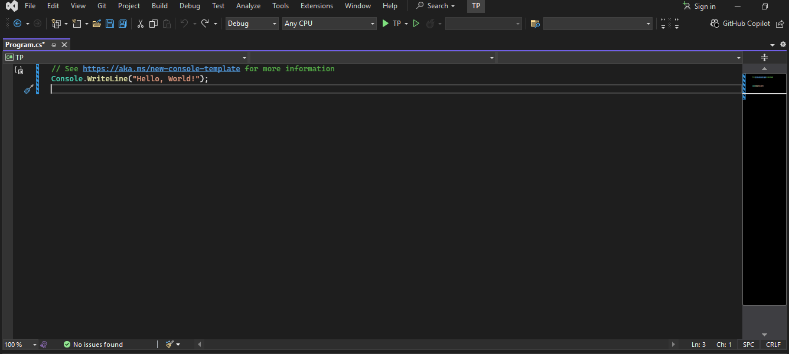
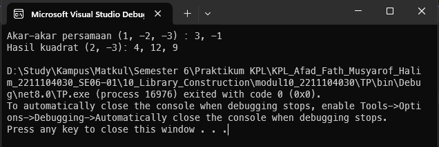

<div align="center">
TP <br>
KONSTRUKSI PERANGKAT LUNAK <br>
<!-- JUDUL -->
<br>


<br>

Disusun Oleh: <br>
Afad Fath Musyarof Halim <br>
2211104030 <br>
SE-06-01 <br>

<br>

Asisten Praktikum : <br>
Naufal El Kamil Aditya Pratama Rahman <br>
Imelda Alfiana Palupi Dewi <br>

<br>

Dosen Pengampu : <br>
Yudha Islami Sulistya, S.Kom., M.Cs <br>

<br>

PROGRAM STUDI S1 REKAYASA PERANGKAT LUNAK <br>
FAKULTAS INFORMATIKA <br> 
TELKOM UNIVERSITY PURWOKERTO <br>

</div>
<hr>

## 1. Membuat Project <br>

## 2. Membuat Library <br>
``` C#
namespace Aljabar
{
    public class Class1
    {
    public static double[] AkarKuadrat(double[] psm)
        {
            double a = psm[0];
            double b = psm[1];
            double c = psm[2];

            double disc = b * b - 4 * a * c;

            if (disc < 0)
                return new double[] { };

            double square = Math.Sqrt(disc);
            double x1 = (-b + square) / (2 * a);
            double x2 = (-b - square) / (2 * a);

            return new double[] { x1, x2 };
        }

        public static double[] HasilKuadrat(double[] psm)
        {
            double a = psm[0];
            double b = psm[1];

            double x2 = a * a;
            double x = 2 * a * b;
            double kons = b * b;

            return new double[] { x2, x * -1, kons };
        }
    }
}
```
## 3. Menggunakan Library <br>
``` C#
using Aljabar;

double[] akar = Class1.AkarKuadrat(new double[] { 1, -2, -3 });
double[] hasil = Class1.HasilKuadrat(new double[] { 2, -3 });


Console.WriteLine("Akar-akar persamaan (1, -2, -3) : " + string.Join(", ", akar));
Console.WriteLine("Hasil kuadrat (2, -3): " + string.Join(", ", hasil));
```
## 4. Output <br>

## 5. Penjelasan <br>
1. **Library Aljabar**: Library ini menyediakan fungsi untuk menghitung akar-akar persamaan kuadrat menggunakan rumus kuadrat (`AkarKuadrat`) dan mengembalikan hasil kuadrat dari suatu ekspresi linear (`HasilKuadrat`). Kedua fungsi ini menerima array sebagai input dan mengembalikan array berisi hasil perhitungan.

2. **Penggunaan Library**: Library digunakan dengan memanggil metode `AkarKuadrat` dan `HasilKuadrat` secara langsung dari `Class1`, lalu menampilkan hasilnya ke konsol. Contohnya, akar-akar persamaan kuadrat `(1, -2, -3)` dan hasil kuadrat `(2, -3)` dihitung dan ditampilkan dalam bentuk string yang dipisahkan koma.