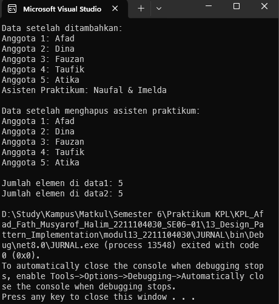

<div align="center">
JURNAL <br>
KONSTRUKSI PERANGKAT LUNAK <br>
<!-- JUDUL -->
<br>


<br>

Disusun Oleh: <br>
Afad Fath Musyarof Halim <br>
2211104030 <br>
SE-06-01 <br>

<br>

Asisten Praktikum : <br>
Naufal El Kamil Aditya Pratama Rahman <br>
Imelda Alfiana Palupi Dewi <br>

<br>

Dosen Pengampu : <br>
Yudha Islami Sulistya, S.Kom., M.Cs <br>

<br>

PROGRAM STUDI S1 REKAYASA PERANGKAT LUNAK <br>
FAKULTAS INFORMATIKA <br> 
TELKOM UNIVERSITY PURWOKERTO <br>

</div>
<hr>

## 1. Membuat Project
## 2. Menjelaskan Singleton
### A. Dua Contoh Kondisi Penggunaan "Singleton" Design Pattern  
1. **Manajemen Koneksi Database**  
   Singleton pattern dapat digunakan untuk mengelola koneksi database. Dengan menggunakan Singleton, kita memastikan bahwa hanya satu instance koneksi database yang dibuat dan digunakan oleh seluruh aplikasi. Ini mencegah pembukaan koneksi berlebihan yang dapat membebani sistem.  

2. **Pengelolaan Konfigurasi Aplikasi**  
   Singleton dapat digunakan untuk mengelola konfigurasi aplikasi. Misalnya, ketika aplikasi memuat konfigurasi dari file, kita bisa memastikan bahwa hanya satu instance objek konfigurasi yang digunakan di seluruh aplikasi, sehingga menghindari pembacaan file berulang kali.  

---

### B. Langkah-Langkah Implementasi "Singleton"  
1. **Buat Constructor Private**  
   Membuat constructor private atau protected untuk mencegah pembuatan instance baru dari luar kelas.  

2. **Buat Method Static untuk Mengakses Instance**  
   Buat method static (misalnya `getInstance()`) yang mengembalikan instance tunggal dari kelas. Method ini akan membuat instance baru hanya jika belum ada.  

3. **Simpan Instance dalam Variabel Statis**  
   Simpan instance tunggal dalam variabel statis (static variable) di dalam kelas.  

### C. Kelebihan dan Kekurangan "Singleton"  

**Kelebihan:**  
1. **Kontrol Akses ke Instance**: Hanya ada satu instance yang digunakan di seluruh aplikasi, sehingga memudahkan kontrol penggunaan sumber daya.  

2. **Penghematan Memori**: Dengan menggunakan satu instance, Singleton mengurangi penggunaan memori karena tidak ada duplikasi objek yang tidak perlu.  

3. **Akses Global**: Akses global ke instance tunggal, sehingga dapat diakses dari mana saja dalam aplikasi.  

**Kekurangan:**  
1. **Sulit untuk Diuji**: instance tunggal dipertahankan selama aplikasi berjalan, sehingga sulit menggantinya dengan mock object.  

2. **Pelanggaran Prinsip Single Responsibility**: Singleton sering menambah tambahan seperti manajemen lifecycle instance, yang melanggar prinsip Single Responsibility.  

3. **Potensi Masalah dalam Aplikasi Multithread**: Singleton dapat menyebabkan masalah dalam lingkungan multithread, seperti pembuatan instance ganda.  

## 3. Implementasi Program
1. Singleton
``` C#
public class PusatDataSingleton
{
    // Atribut
    private List<string> DataTersimpan;
    private static PusatDataSingleton _instance;

    // Konstruktor private
    private PusatDataSingleton() {
        DataTersimpan = new List<string>();
    }

    // Method GetDataSingleton
    public static PusatDataSingleton GetDataSingleton()
    {
        if (_instance == null) _instance = new PusatDataSingleton();
        return _instance;
    }

    // Method GetSemuaData
    public List<string> GetSemuaData() { 
        return DataTersimpan; 
    }

    // Method PrintSemuaData
    public void PrintSemuaData() {
        foreach (string data in DataTersimpan){
            Console.WriteLine(data);
        }
    }

    // Method AddSebuahData
    public void AddSebuahData(string input) {
        DataTersimpan.Add(input);
    }

    // Method HapusSebuahData
    public void HapusSebuahData(int index) {
        if (index >= 0 && index < DataTersimpan.Count) {
            DataTersimpan.RemoveAt(index);
        }
        else {
            Console.WriteLine("Index tidak valid.");
        }
    }
}
```
2. Program Utama
``` C#

// A. Buat dua variabel dengan tipe "PusatDataSingleton"
PusatDataSingleton data1;
PusatDataSingleton data2;

// B. Isi kedua variabel dengan hasil keluaran dari GetDataSingleton()
data1 = PusatDataSingleton.GetDataSingleton();
data2 = PusatDataSingleton.GetDataSingleton();

// C. Pada data1, tambahkan beberapa data nama anggota kelompok dan asisten praktikum
data1.AddSebuahData("Anggota 1: Afad");
data1.AddSebuahData("Anggota 2: Dina");
data1.AddSebuahData("Anggota 3: Fauzan");
data1.AddSebuahData("Anggota 4: Taufik");
data1.AddSebuahData("Anggota 5: Atika");
data1.AddSebuahData("Asisten Praktikum: Naufal & Imelda");

// D. Pada data2, panggil PrintSemuaData() untuk memastikan data yang ditambahkan muncul
Console.WriteLine("Data setelah ditambahkan:");
data2.PrintSemuaData();

// E. Pada data2, hapus nama asisten praktikum
data2.HapusSebuahData(5);

// F. Pada data1, panggil PrintSemuaData() untuk memastikan asisten praktikum telah dihapus
Console.WriteLine("\nData setelah menghapus asisten praktikum:");
data1.PrintSemuaData();

// G. Pada data1 dan data2, panggil GetSemuaData() dan cetak jumlah elemen di list
List<string> semuaData1 = data1.GetSemuaData();
List<string> semuaData2 = data2.GetSemuaData();

Console.WriteLine("\nJumlah elemen di data1: " + semuaData1.Count);
Console.WriteLine("Jumlah elemen di data2: " + semuaData2.Count);
```

## 4. Output

## 5. Penjelasan
1. GetDataSingleton(): Fungsi ini mengembalikan instance tunggal dari PusatDataSingleton, memastikan hanya ada satu objek yang dibuat (single instance). Ini adalah inti dari pola Singleton, mengontrol akses global ke instance kelas.
2. AddSebuahData(), HapusSebuahData(), PrintSemuaData(), GetSemuaData(): Fungsi-fungsi ini mengoperasikan data pada instance Singleton yang sama, memastikan konsistensi data di semua variabel yang mereferensikan instance tersebut (shared state). Perubahan melalui satu referensi (misal data1) langsung tercermin di referensi lain (data2), menunjukkan keberhasilan implementasi Singleton.