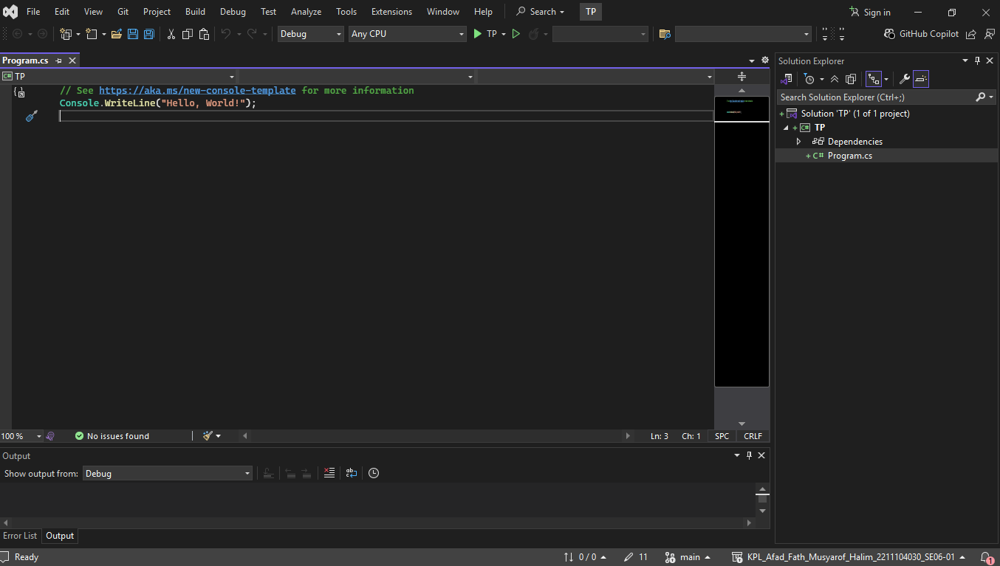
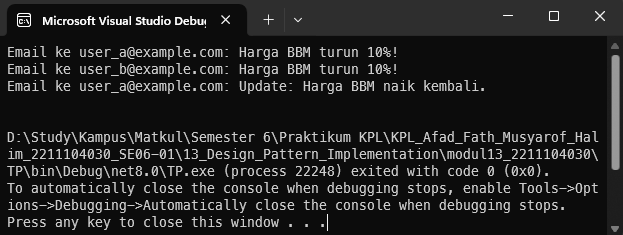

<div align="center">
TUGAS PENDAHULUAN <br>
KONSTRUKSI PERANGKAT LUNAK <br>
<!-- JUDUL -->
<br>


<br>

Disusun Oleh: <br>
Afad Fath Musyarof Halim <br>
2211104030 <br>
SE-06-01 <br>

<br>

Asisten Praktikum : <br>
Naufal El Kamil Aditya Pratama Rahman <br>
Imelda Alfiana Palupi Dewi <br>

<br>

Dosen Pengampu : <br>
Yudha Islami Sulistya, S.Kom., M.Cs <br>

<br>

PROGRAM STUDI S1 REKAYASA PERANGKAT LUNAK <br>
FAKULTAS INFORMATIKA <br> 
TELKOM UNIVERSITY PURWOKERTO <br>

</div>
<hr>

## 1. Membuat Project <br>

## 2. Menjelaskan Observer <br>

**A. Contoh Penggunaan Design Pattern “Observer”**  
Contohnya sistem notifikasi berita. Misalnya, sebuah aplikasi berita memiliki fitur dimana pengguna dapat berlangganan kategori tertentu (olahraga, politik, dll.). Ketika ada artikel baru di kategori tersebut, semua pelanggan otomatis menerima notifikasi (email, push notification, SMS). Di sini, aplikasi berita sebagai **Subject** dan pengguna sebagai **Observer** yang akan diinformasikan ketika terjadi perubahan (artikel baru).  

---

**B. Langkah Implementasi Observer Pattern**  
1. **Buat Subject Interface/Abstract Class**  
   - Definisikan metode untuk menambah (`attach`), menghapus (`detach`), dan memberitahu (`notify`) observer.  
2. **Buat Concrete Subject**  
   - Implementasikan antarmuka Subject.  
   - Simpan data/state yang perlu diamati.  
   - Ketika state berubah, panggil metode `notify` untuk mengupdate semua observer.  
3. **Buat Observer Interface**  
   - Definisikan metode `update` yang dipanggil saat Subject memberi notifikasi.  
4. **Buat Concrete Observer**  
   - Implementasikan metode `update` untuk merespons perubahan state dari Subject.  
   - Setiap observer bisa melakukan aksi spesifik berdasarkan data yang diterima (misal: tampilkan notifikasi).  
---

**C. Kelebihan dan Kekurangan Observer**  
**Kelebihan:**  
1. **Decoupling**: Subject dan Observer tidak tergantung satu sama lain secara langsung.  
2. **Dinamis**: Bisa menambah/hapus observer saat runtime tanpa mengubah Subject.  
3. **Event-driven**: Memungkinkan reaksi real-time terhadap perubahan state.  

**Kekurangan:**  
1. **Urutan Notifikasi Tidak Terkontrol**: Tidak ada jaminan urutan observer yang menerima update.  
2. **Overhead Memori**: Jumlah observer besar dapat memengaruhi performa.  
3. **Risk of Memory Leaks**: Jika observer tidak di-`detach` dengan benar (misal: menggunakan reference yang tidak dihapus).  
4. **Update Cascade**: Perubahan di observer bisa memicu update berantai yang kompleks.  

## 3. Implementasi Observer
``` C#
using System;

public class NewsPublisher {
    public event EventHandler<string> NewsPublished;

    private string _latestNews;

    public void SetNews(string news) {
        _latestNews = news;
        OnNewsPublished();
    }

    protected virtual void OnNewsPublished() {
        NewsPublished?.Invoke(this, _latestNews);
    }
}

public class EmailSubscriber
{
    private string _email;

    public EmailSubscriber(string email) {
        _email = email;
    }

    public void HandleNewsUpdate(object sender, string news) {
        Console.WriteLine($"Email ke {_email}: {news}");
    }
}

public class Program {
    static void Main(string[] args) {
        var newsPublisher = new NewsPublisher();

        var userA = new EmailSubscriber("user_a@example.com");
        var userB = new EmailSubscriber("user_b@example.com");

        // Langganan event
        newsPublisher.NewsPublished += userA.HandleNewsUpdate;
        newsPublisher.NewsPublished += userB.HandleNewsUpdate;

        newsPublisher.SetNews("Harga BBM turun 10%!");

        // Berhenti berlangganan
        newsPublisher.NewsPublished -= userB.HandleNewsUpdate;
        newsPublisher.SetNews("Update: Harga BBM naik kembali.");

        Console.ReadLine();
    }
}
```

## 4. Output

## 5. Penjelasan
1. **Inisialisasi**: Membuat objek NewsPublisher (Subjek) dan dua observer (userA dan userB), lalu mendaftarkan observer ke Subjek.
2. **Notifikasi Pertama**: Memanggil SetNews(...) untuk mengupdate berita, mengirim notifikasi ke semua observer terdaftar (userA dan userB).
3. **Update Selektif**: Menghapus observer userB dengan Detach(), lalu SetNews(...) kedua hanya mengirim notifikasi ke userA.