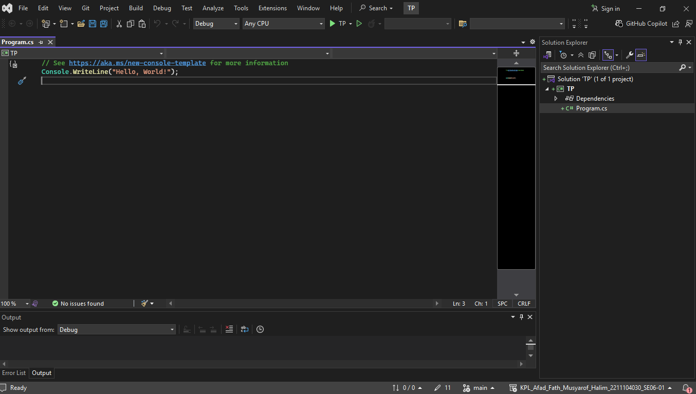

<div align="center">
TUGAS PENDAHULUAN <br>
KONSTRUKSI PERANGKAT LUNAK <br>
<!-- JUDUL -->
<br>


<br>

Disusun Oleh: <br>
Afad Fath Musyarof Halim <br>
2211104030 <br>
SE-06-01 <br>

<br>

Asisten Praktikum : <br>
Naufal El Kamil Aditya Pratama Rahman <br>
Imelda Alfiana Palupi Dewi <br>

<br>

Dosen Pengampu : <br>
Yudha Islami Sulistya, S.Kom., M.Cs <br>

<br>

PROGRAM STUDI S1 REKAYASA PERANGKAT LUNAK <br>
FAKULTAS INFORMATIKA <br> 
TELKOM UNIVERSITY PURWOKERTO <br>

</div>
<hr>

## 1. Membuat Project <br>

## 2. Refactoring Code <br>
``` C#
using System;


public class NewsPublisher {
    public event EventHandler<string> NewsPublished;

    private string _latestNews;

    public void SetNews(string news) {
        _latestNews = news;
        OnNewsPublished();
    }

    protected virtual void OnNewsPublished() {
        NewsPublished?.Invoke(this, _latestNews);
    }
}

/// <summary>
/// Represents a subscriber that receives news updates via email.
/// </summary>
public class EmailSubscriber
{
    private string _email;

    /// <summary>
    /// Initializes a new instance with the specified email address.
    /// </summary>
    /// <param name="email">The subscriber's email address.</param>
    public EmailSubscriber(string email) {
        _email = email;
    }

    /// <summary>
    /// Handles news updates and sends them to the subscriber's email.
    /// </summary>
    public void HandleNewsUpdate(object sender, string news) {
        Console.WriteLine($"Email ke {_email}: {news}");
    }
}

public class Program {
    static void Main(string[] args) {
        var newsPublisher = new NewsPublisher();

        var userA = new EmailSubscriber("user_a@example.com");
        var userB = new EmailSubscriber("user_b@example.com");

        // Langganan event
        newsPublisher.NewsPublished += userA.HandleNewsUpdate;
        newsPublisher.NewsPublished += userB.HandleNewsUpdate;

        newsPublisher.SetNews("Harga BBM turun 10%!");

        // Berhenti berlangganan
        newsPublisher.NewsPublished -= userB.HandleNewsUpdate;
        newsPublisher.SetNews("Update: Harga BBM naik kembali.");

        Console.ReadLine();
    }
}
```
## 3. Penjelasan
Kode yang di ambil adalah kode TP dari modul 13. Kode sudah baik secara struktur, tetapi kurang dokumentasi